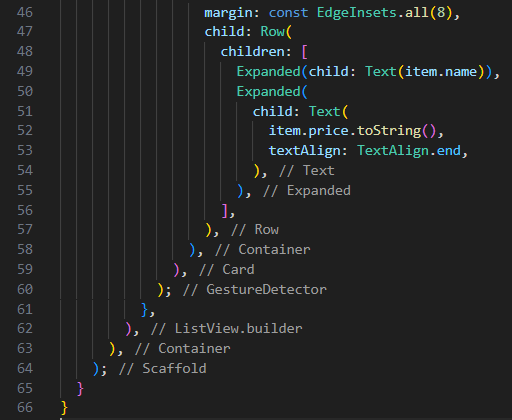

1. Buatlah folder "models" dan "pages" di dalam folder lib

2. Buatlah file "item.dart" di folder models dan buatlah file "home_page.dart", "item_page.dart" di folder pages

3. Sintaks dari file "item.dart"

4. Sintaks dari file "home_page.dart", "item_page.dart", "item.dart", dan "main.dart"

"home_page.dart

"item_page.dart"

"main.dart"

5. Hasil akhir dari project akan tampil seperti berikut

